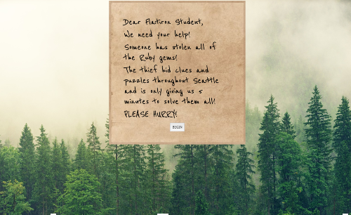

# Seattle Escape Room!

## Flatiron School Module 3 Group Project

### Abstract

In the context of Flatiron School Module Three, we implemented front and backend functionality to experience a novel escape room! Escape the Seattle Escape Room! Beat your time and try to get the number one spot on the leaderboard! Our Escape Room runs off of Ruby on Rails for the backend, and Javascript for the front end.

As per our Module 3 curriculum and guidelines, only vanilla JS was used for the frontend.

Two NPM Libraries were used - Moment.js and Animate.css

### How to Run

After forking and cloning the repository, open up ‘escaperoom-backend’ in your terminal and run ‘bundle install’. After running bundle install, run ‘rails s’ to open up the server.

Open up another terminal window and open ‘escaperoom-frontend’. Run 'npm install'. From here, open index.html to start the game!

### Project Requirements

Project is built with a HTML/CSS/JS frontend and a Rails API backend with at least three resources modeled in the API.

All CRUD interactions between the frontend and backend occur via fetch() without a page refresh.

At least one API endpoint rendersout a nested resource.Custom CSS styling.

Not purely bare-bones HTML.

JavaScript properly waits for DOM to load.

Good separation of concerns between structure, styling and interactivity between HTML/CSS and JavaScript.

The project handles events appropriately and uses preventDefault() to prevent unnecessary page refreshes.

### Screenshots

